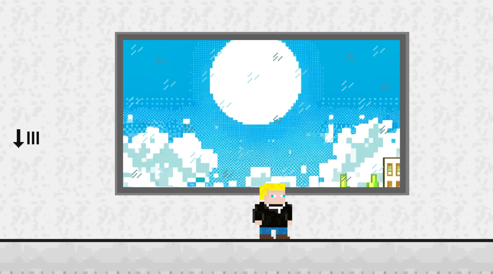
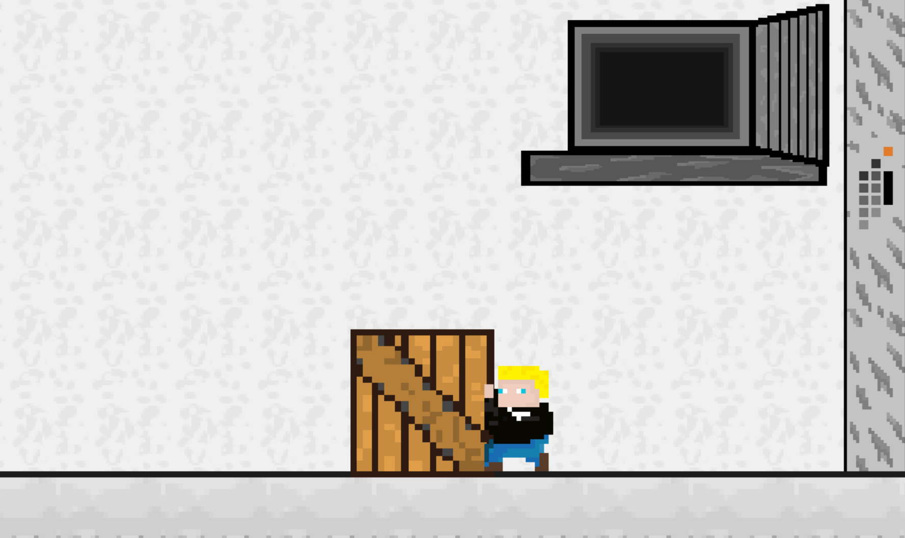
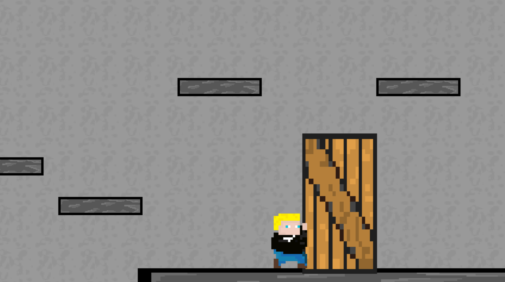
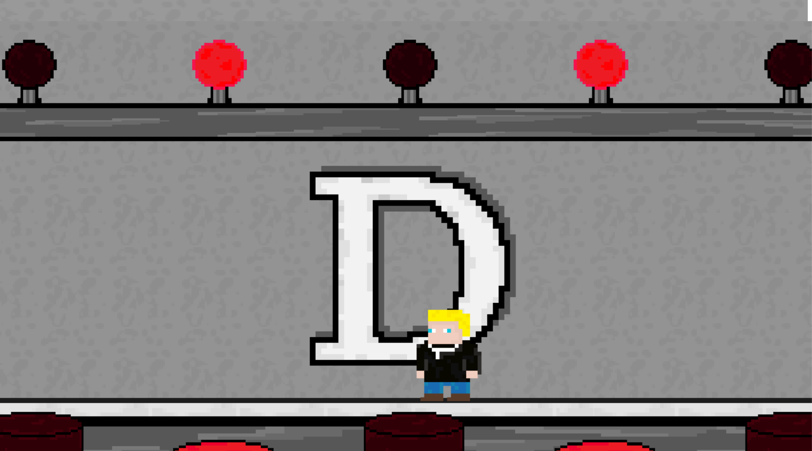

# Python-Project
made in collaboration with Krzysztof Swedziol  
https://github.com/KrzysztofSwedziol

In order to run the game, after doing git clone intstall Pygame using pip, and than simply run Game.py file  

Some screenshots:

### Screen 1

### Screen 2

### Screen 3

### Screen 4

